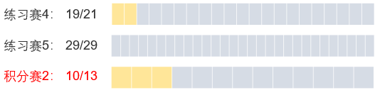
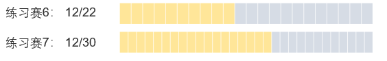
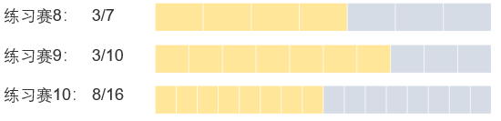
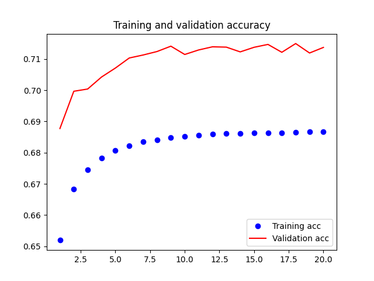
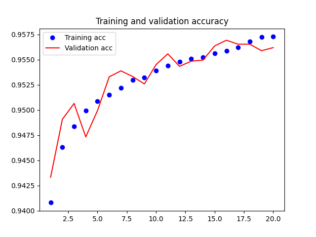
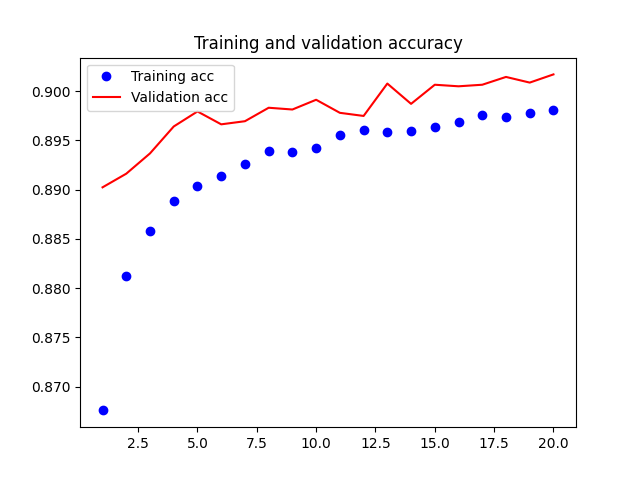

强化学习期末

[TOC]

## 小组成员与分工

- 陈仁泽(1700012774)：前期调研；项目框架搭建；CNN网络的部署训练。
- 谭钧尹(1800012956)：前期调研；rule-based策略设计与实现。
- 冯睿杰(1800013065)：前期调研；CNN策略设计与实现。


## 项目结构

+ `data/`：CNN网络训练出的参数以及训练结果。 
+ `3rdparty/`：第三方组件。
  + `fan-calculator/`：算番器。
+ `handin.py`：构建可执行文件。
+ `mj_bot/`
  + `__main__.py`：程序入口处，设置当前的策略(tactic)，处理和botzone的交互。
  + `generate_dataset.py`：生成训练CNN网络需要的数据。
  + `train.py`：训练CNN网络。
  + `mahjong/`：mahjong模块，代码主要放这里。
    + `common.py`：和游戏相关的一些玩意。
      + 一些常量字符串，比如`PASS`，`PLAY`，`PENG`，`CHI`等。
      + `Meld`类：用于表示一组明牌。
        + `type`：明牌的类型，分为`CHI`、`PENG`、`GANG`（顺子、刻子、杠子）。
        + `cards`：该明牌包含的牌，为字符串列表。
        + `src_pid`：吃、碰、直杠的对象的player id。
        + `src_card`：从吃、碰、直杠的对象处获得的牌。
      + `Player`类：用于表示玩家的全局可见信息。
        + `player_id`：字面意思。
        + `melds`：玩家的明牌。
        + `n_flowers`：玩家的花牌数。
        + `history`：玩家的操作历史（略去了摸牌操作和补花操作）。
        + `played`：玩家打出过的牌。
      + `GameState`类：用于表示当前的对局状态，包含所有玩家的全局可见信息，以及自己部分可见信息。
        + `my_pid`：我的player id。
        + `my_hand`：我的手牌。
        + `players`：所有玩家的全局可见信息。
        + `history`：所有玩家的操作历史（包含摸牌操作和补花操作）。
        + `load_json(input_json)`：输入一个json对象，用其转换为对局状态。
        + `action_space()`：返回一个列表，列表的元素为元组，形如`(PLAY, Card0)`、`(PENG, Card1)`，与[botzone国标麻将的response](https://wiki.botzone.org.cn/index.php?title=Chinese-Standard-Mahjong)的格式类似（除了胡牌的动作，胡牌的动作为`(HU, n_fan)`，其中`n_fan`代表番数）。该列表表示当前所有的可行操作（可能存在重复的元素）。
    + `tactic/`：包含出牌策略。
      + `rand.py`：简单的随机策略，仅从`action_space`中随机选取一个action返回（如果可以胡牌的话肯定会胡牌）。
      + `cnn.py`：利用训练出的CNN网络做决策的策略。
      + `rule_based.py`：rule-based策略。


## 项目使用

### 构建bot

运行根目录的文件`handin.py`：

```python
python3 handin.py
```

会在根目录获得可执行文件`mj_bot.pyz`，可直接用于在botzone上构建bot。


### 构建算番器

本地调试需要在本地构建算番器。在项目根目录执行：

```shell
cd 3rdparty/fan-calculator/Mahjong-GB-Python/
python3 setup.py install --user
```


### 修改策略

在`tactic/`中添加新的文件、函数。一个出牌策略应该是一个函数，参数为一个`GameState`，返回一个action（类似`GameState.action_space`函数返回的列表的元素）。


## 调研工作

### [*Method for Constructing Artificial Intelligence Player with Abstraction to Markov Decision Processes in Multiplayer Game of Mahjong*](https://arxiv.org/pdf/1904.07491.pdf)

+ 内容简介：
  + 形式化地构建了麻将游戏（该文中以日麻作为标准）中各个玩家的MDP模型。
  + 在构建的MDP的基础上推导出对局状态的估值函数（函数中的诸多参数需要借助统计学习手段获得）。
+ 对项目的帮助：
  + 本文更注重模型的构建与分析，对搜索策略的设计有一定启发，但暂无更多的帮助。


### [*Building a Computer Mahjong Player via Deep Convolutional Neural Networks*](https://arxiv.org/pdf/1906.02146v2.pdf)

[参见策略设计中的监督学习部分](#监督学习)


### [*A novel deep residual network-based incomplete information competition strategy for four-players Mahjong games*](https://www.researchgate.net/journal/Multimedia-Tools-and-Applications-1573-7721/publication/332881141_A_novel_deep_residual_network-based_incomplete_information_competition_strategy_for_four-players_Mahjong_games/links/5f75901692851c14bca41166/A-novel-deep-residual-network-based-incomplete-information-competition-strategy-for-four-players-Mahjong-games.pdf?_sg%5B0%5D=amkTcQ6o_rJdTlcjZFDc9XRLxgxsIpNoSYpLNb4RkEE9uO7OYOwKumZ8KQZM5acAX1KAlPLiq6d3HXASEBOJ2Q.Z-zRoSUklBStPXTIOBwmYPfvEZbdA0nBOQSDmixKiBpv_wLFE9T5zvZrzxMIS-hhu1Pz7_FclS0HEUs3mwsxTA&_sg%5B1%5D=sRDGRRFARzULWKLg4fNj4OJnce7Mow2qEonxyuQfhzMsOuSuRsthwTwbogxzu-yoaIPblOSqlG0-uCmef6yu7Q5x5_7MIi8lJrv5cnkua2qn.Z-zRoSUklBStPXTIOBwmYPfvEZbdA0nBOQSDmixKiBpv_wLFE9T5zvZrzxMIS-hhu1Pz7_FclS0HEUs3mwsxTA&_iepl=)

+ 内容简介：
  + 用了Google在2014年ILSVRC上夺冠的网络模型GoogleNet，它的优势是在保持残差网络的稀疏性的前提下能利用密集矩阵的高计算性能；它的每个单元被称为Inception，如同人类的神经元一样可以重复堆积。
  + 论文将Inception做了一定的适于麻将游戏的改进，得到了Inception+，作为网络基础。
  + 在问题的建模上，文章选取了两部分信息作为输入：一是自身信息，如手牌数、搭子数、孤牌数、上听数等；二是局势信息，如轮数、动作对应的上听数的改变量、打出的手牌。
+ 对项目的帮助：
  + 让我们坚定了用监督学习来训练的想法
  + 输入的选择上对Rule-based有一定启发；比如考虑轮数对当前决策的影响。


## 策略设计

### 搜索策略

搜索对象：没有选择对”打某哪一张牌“或者”是否鸣牌“的<u>动作</u>的估值，选择了对整体<u>状态</u>估值。

#### 价值函数

> 总体思路：面向常见的八大番和八小番等大约16种牌型，分别搜索上听数

##### 1.上听数部分

###### 顺子系

[^顺子系]: 三色三步高，三色三同顺，一色三步高，一色三同顺，花龙，清龙，组合龙。它们在国标主要主番出现率合计约为60%。

①预先建立好目标牌型库targets_table

- targets_table中的每个牌型，即target中，只包含了番型必需的牌，例如“三色三步高”中的一个牌型示例为：

$$
target = W3\ W4\ W5\ B4\ B5\ B6\ T5\ T6\ T7
$$
- 我们把以上的牌称为“主牌”。但是为了和牌，还需要剩余的5张牌是“一面子 + 一雀头”，也就是“副牌”，这个我们留到后续处理。


- 顺子系的特点是主牌的种数很有限，因此可以将“分离副牌与主牌”的方法应用到顺子系的上听数搜索中，这样大大缩减了牌型库，加速搜索。


```python
shanten = 0		# 上听数初始化
target <-- from targets_table  # 和牌牌型库（target:主牌）
need, match, remain <-- target & my_cards  
# 目标牌型target和当前手牌my_hands取交集（match）、差集（need、remain）
need, remain <-- basic_shanten(1，1，remain) 
#用remain凑“一面子+一雀头”，得到最终的need(需要的牌)、remain(手牌的零头)
```


②need：直接对应上听数，但是要考虑被摸到的概率

- 上听数+=need中的每张牌x摸到需要的牌的概率st_diff


```python
st_diff = [10, 1.1, 1, 0.9, 0.8] 
# 根据一张牌的剩余张数的信息，将摸到这张牌的概率简化为固定的参数；
# 比如需要的牌已经没有了，对应st_diff[0]=10,摸到的难度为10，加给上听数就一票否决了这个牌型；
# 若需要的牌还剩2张，对应摸到它的上听数为st_diff[2]=1。
# 当然剩余张数没有考虑对手手牌中是否持有。
for every card in need:
    shanten += card * st_diff[REMAIN_CARDS[card]] # 加入权重
```


③remain：鼓励多凑搭子、少留孤牌

- 奖励在剩余牌中留对子、留搭子；孤牌应有打出的先后顺序：风牌 箭牌 > 1 9 > 2 8 > 3~7


```python
shanten -= connection_bonus(remain)
```


④考虑大数据中不同番型的胡牌概率 

- 不同番型的国标主要主番出现率是不同的，出现率高意味着它和牌的概率高。因此我们根据下图直接将上听数减去对应的出现率，使得策略更倾向于往出现率高的番型发展。


```python
shanten -= fan_distribution[fan_type]
```


⑤最终上听数输出

- 在shanten中选出最小的，赋值给ans即可。这就对应当前手牌（在顺子系下）的上听数。


###### 其它番型

- 对于<u>五门齐</u>、<u>混一色</u>、<u>大于五</u>、<u>小于五</u>这类同样需要顺子的番型，我们并没有为它们建立主牌牌型库，这是因为它们的牌型库相对规模较大，主副牌分离并不能很好地提高效率，因此它们还是回归常规的“面子+雀头数递归”+“已访问节点标记”的dfs算法以获取上听数。


```python
path_visit = []
def basic_shanten(tiles, pair_need, mianzi_need, path=[], priority=2, debug_flag=0, shunzi_lower=1, shunzi_upper=9): # dfs
    if mianzi_need == 0:
         递归终点，处理雀头对应的上听数并返回
    if path in path_visit:
        return 10
    path_visit += path  # path_visit标记已访问节点
    if find a mianzi: #有一个面子
         return basic_shanten(***) # 递归；参数变化：mianzi_need-=1；path += [mianzi]
    elif find a dazi, with need: #有一个搭子，缺的牌是need
         return basic_shanten(***) + st_diff[REMAIN_CARDS[need]] # 递归；参数变化同上
    else:
    	return mianzi_need * 2 + pair_need # 相当于默认所缺的牌的剩余数量为2，近似处理，简化搜索
```

- <u>全不靠</u>、<u>十三幺</u>由于副牌的目标并不是“一面子+一雀头”，因此也独立于顺子系编写算法，思路更类似于五门齐。同样，<u>碰碰和</u>、<u>三暗刻</u>也基于dfs的算法。

- <u>全求人</u>、<u>七对</u>这两类牌型则由于其剑走偏锋，回不了头，所以在上听数上做了一定的处理，使得上听数偏大时，其价值函数会非常小；但是随着上听数减小，价值函数会递增得非常快。这最终形成了“这类牌不敢轻易做；但是一做就会做到底”的实战表现。

- 本地调试输出展示：


##### 2.策略的稳定性

###### 顺子系

- 以上的顺子系参数有时不能决出最优的目标牌型，在remain的去留选择中，顺子系的backup（次优目标牌型的数量）显得十分重要，我们需要优先选择具有更多的次优目标的状态。


[^backup]: 因为从本次出牌到下一次摸牌的过程中，最优牌型可能会因为需要的牌的剩余数量的急剧变化导致其不再是最优牌型，上听数也就变大。此时就需要受到影响较小的次优牌型站出来，这就是backup（增援）。backup越多，就意味着上听数越能在对手回合中保持稳定。

```python
backup = 0
 for shanten in shantens:
   if shanten - ans <= 1:
     backup += 1 # backup用来选出具有最多的[次优目标牌型]的状态
 return ans - backup / 100
```

###### 其它番型

- 顺子系以外的番型的”次优目标牌型“往往很稀疏，不同牌型之间的差别相对比较大，所以不考虑在它们内部再分别backup，而是考虑在综合所有番型下的上听数时，再做一次backup。


- 各部得到的上听数进行排序，然后将第二位和第三位乘以权重加入到最终的上听数，目的是强化前期往冷门番型上发展的可能性。


- 在最佳上听数不大于2时意味着已经很接近听牌了，故不再考虑第二位和第三位。


```python
st = [st1, st2, st3, st4, st5, st6, st7, st8, st9, st10, st11]
# st1:顺子   st2:五门齐  st3:碰碰和   st4:混一色   st5:全求人   st6:七对 
# st7:十三幺 st8:全不靠  st9:大于五   st10:小于五  st11:三暗刻
st.sort()
if st[0] > 2:
    shanten = st[0] + st[1] * 0.01 + st[2] * 0.005
else:
    shanten = st[0]

```


##### 3.其它补充

1.  由于当前写出的bot不能了解<u>多摸牌</u>的重要性，所以直接给吃的动作扣分，保证只有在吃的动作明显减少一个单位的上听数时才会被选择；另外，也给杠的动作加分。

2.  以上策略只考虑主番的构造，次番并没有刻意去构造，实战中几乎没有发现因为次番不够而无法和牌的情况。再介于我们的估值理论”本就根基不牢“，所以为了不继续破坏当前价值函数的稳定性，不再添加任何对次番的评估。

3.  “放弃点炮等自摸“和”添加防守策略“的思路也在小组讨论后，由于同样的”保证价值函数稳定性“的原因而放弃。


#### 版本迭代及比赛表现

##### v1.1 

- 简单的估值函数value_function1，每个状态的价值取决于其面子、搭子、雀头的数量；选择价值最大的状态。


[^图中的进度条]: 从左到右依次是从最后一名到第一名。黄色格子表示本组bot在积分排名上超过的对手；灰色格子数表示比赛排名

##### v1.2

- 对于value_function1，增加了孤牌的价值，不同孤牌价值不同，设置价值以使得bot可以优先打掉不容易凑搭子的孤牌（风牌，箭牌和1，9数牌）。




##### v2.1

- 弃用value_function1，使用value_function2，也就是以上介绍面向主要番型搜索的策略。将value_function1的估值思路放在了connection_bonus当中。


[^connection_bonus]:出现在“价值函数-1.上听数部分-顺子系-③“

- 番型方面，v2.1版本写好的番型是：<u>三色三步高</u>/<u>三色三同顺</u>/<u>花龙</u>/<u>清龙</u>/<u>七对</u>/<u>五门齐</u>。


- 其中，顺子系的框架已经搭建得很完善，<u>五门齐</u>则采用了非常粗略的近似手段，避开了写必须用到dfs来搜索的basic_shanten。




##### v2.2 

- 继续丰富番型，但是在面对<u>碰碰和</u>/<u>混一色</u>/<u>大于五</u>/<u>小于五</u>这些番型时，发现近似上听数的策略已经不足以支持bot作出顺利到达和牌的策略。最终不得不面对深度搜索，于是冷静思考、梳理逻辑，写了搜上听数最根本的basic_shanten。


- 另一方面，发现顺子系的搜索策略同样适用于<u>组合龙</u>，以及<u>一色三同顺</u>也是一个方便顺带去搜索一下的顺子系牌型，于是加入了这两个番型。


- 另外，非顺子系的特殊牌型也分别写入了策略检索中，具体为：<u>全不靠</u>/<u>十三幺</u>/<u>全求人</u>，并完善了全番型的backup。




##### v2.3

- 最终版本在番型方面补充了<u>清一色</u>和<u>三暗刻</u>，然后对海底捞月、杠牌、风圈相关的一系列bug问题进行了修复。


##### 综合排名


#### 反思与收获

我的反思与收获主要在估值函数的理论框架上面。

1. 对于摸到想要的牌的概率，用自定义的参数st_diff是一个不准确的做法，用以全概率公式为基础的概率计算是比较合理的；	

2. 防守策略是比较重要的一环，降低自己的点炮率能够显著提升比赛表现。但是防守策略的表现与猜对手手牌的准确程度紧密相关，由于没有实现后者，前者也只能是空中阁楼；	

3. 面向有限的番型搜索，对于国标麻将的rule_based策略设计是可行的。


### 监督学习

[*Building a Computer Mahjong Player via Deep Convolutional Neural Networks*](https://arxiv.org/pdf/1906.02146v2.pdf)

监督学习希望使得agent的出牌和训练集的出牌尽量一致，提高agreement rate。

分别训练3个网络：出牌网络、碰网络和吃网络。杠的数据较少，直接采用规则。和牌番数足够就选择和。

#### 训练集

使用人类玩家的对局数据作为训练集。

##### 数据表示

- 数据是大小为63 x 34 × 4，是63个34 × 4的0/1矩阵。
- 矩阵的每个元素对应麻将的一张牌，34行分别对应麻将的34种花色，4列即每种牌4张
  - 1表示有该牌，0表示没有。
  - 某花色有1张牌，对应行就是1 0 0 0；有2张，对应行就是1 1 0 0；以此类推……
- 为了表示一个操作时的状态，共需要63个矩阵
  - 自己的手牌：1个
  - 4名玩家的明牌（吃、碰、杠）：4个
  - 4名玩家历史出过的牌：4个
  - 过去6次自己出牌时，以上的9个矩阵：9 × 6个

##### 标签

- 出牌网络：出什么牌，有34种可能性
- 碰网络：碰或不碰
- 吃网络：不吃，作为第1、2、3张吃，共4种可能性

#### 网络

- 3块，每块由1个卷积层、1个Batch normalization层和1个Dropout层组成，激活函数使用ReLU
  - 卷积层：卷积核大小为5 × 2，filters数量为100，不使用padding
  - Dropout 层：Dropout Rate设为0.5
- 之后再接上一个flatten层和一个300个神经元的全联接层
- 最后根据3个网络的不同特点使用34选1、2选1和4选1的输出层

#### 训练结果

训练时将1/8的数据作为测试集，将7/8的数据作为训练集，batch大小设置为32，训练20个Epoch。



出牌网络在验证集上的准确率约为87.5%。



碰牌网络在验证集上的准确率约为95.75%。



吃牌网络在验证集上的准确率约为90%。

#### 实战效果

> 回放网址 番数 最大番 使用方法
>
> https://botzone.org.cn/match/5fedc963d9383f7579afd8ae 10 三色三步高 Rule
> https://botzone.org.cn/match/5fedcc69d9383f7579afde07 15 三色三步高 CNN
> https://botzone.org.cn/match/5fedd038d9383f7579afe547 57 清一色、一色三同顺 CNN
> https://botzone.org.cn/match/5fedd19bd9383f7579afe729 17 海底捞月 CNN
> https://botzone.org.cn/match/5fedd332d9383f7579afe9af 16 花龙 Rule
> https://botzone.org.cn/match/5fedd546d9383f7579afecb1 20 清龙 Rule
> https://botzone.org.cn/match/5fedd4f0d9383f7579afec5a 19 清龙 Rule
> https://botzone.org.cn/match/5fedd6dcd9383f7579afeec4 8 三色三步高 Rule
> https://botzone.org.cn/match/5fedd89dd9383f7579aff10d 8 全求人 CNN
> https://botzone.org.cn/match/5fedd99fd9383f7579aff1fb 10 全求人 CNN
> https://botzone.org.cn/match/5feddc19d9383f7579aff728 11 三色三步高 CNN
> https://botzone.org.cn/match/5fedde6dd9383f7579affa4d 9 三色三步高 Rule
> https://botzone.org.cn/match/5feddfecd9383f7579affc7e 8 三色三步高 Rule
> https://botzone.org.cn/match/5fede01dd9383f7579affca7 11 三色三步高 Rule
> https://botzone.org.cn/match/5fede186d9383f7579affe45 20 清龙 Rule
> https://botzone.org.cn/match/5fede0afd9383f7579affd42 14 三色三同顺 Rule
> https://botzone.org.cn/match/5fede3bed9383f7579b000cb 19 一色三步高 CNN
> https://botzone.org.cn/match/5fede43cd9383f7579b00167 11 三色三步高 CNN
> https://botzone.org.cn/match/5fede4b8d9383f7579b00205 101 大三元 CNN
> https://botzone.org.cn/match/5fede6a5d9383f7579b003ff 9 三色三步高 Rule
> https://botzone.org.cn/match/5fede62cd9383f7579b00385 9 全求人 CNN
> https://botzone.org.cn/match/5fede619d9383f7579b00367 8 全求人 Rule
> https://botzone.org.cn/match/5fede73cd9383f7579b00481 9 全求人 Rule
> https://botzone.org.cn/match/5fede7a4d9383f7579b004d8 9 花龙 Rule
> https://botzone.org.cn/match/5fede82bd9383f7579b00596 9 全求人 CNN
> https://botzone.org.cn/match/5fede91ed9383f7579b0069b 9 全求人 Rule
> https://botzone.org.cn/match/5fede96ed9383f7579b006ee 8 全求人 Rule
> https://botzone.org.cn/match/5fedeb2fd9383f7579b008ea 9 五门齐 CNN
> https://botzone.org.cn/match/5fedeb13d9383f7579b008be 16 混一色、全求人 CNN
> https://botzone.org.cn/match/5fedecc5d9383f7579b00a86 12 三色三同顺 Rule
> https://botzone.org.cn/match/5fedeb95d9383f7579b00961 15 妙手回春 Rule
> https://botzone.org.cn/match/5fedea8bd9383f7579b00819 32 全双刻 CNN
> https://botzone.org.cn/match/5fedee1ad9383f7579b00c5d 9 全求人 CNN

在第二次积分赛前（12月31日），我们将监督学习的Bot和基于规则的Bot进行了2v2（对家采用相同的Bot）的33场对局，结果Rule-based获胜了18场，平均番数为11.89番；卷积神经网络的Bot获胜15场，平均番数为22.2番。可以看出，监督学习的Bot和牌次数较少，但是平均番数较大，这可能是因为当时Rule-based的Bot只编写了部分出现频率最高、番数较少的番型的规则。而监督学习的和牌番数较大，说明当起手较好时，其确实可以像人类玩家一样朝大的番型做牌。

但是从多次练习赛的结果上看，监督学习的效果不如Rule-based的效果，在练习赛7中排名第30（规则Bot排名第12），在练习赛9中排名第10（规则Bot排名第3），在练习赛10中排名第15（规则Bot排名第8），可能的原因是出牌的准确率只有约70%，而这30%的非按标签出牌，造成不利的影响可能是决定性的。其次，人类数据集的出牌也不一定是最优策略，可能有其局限性。

#### 训练投入的算力和时间

TBA
